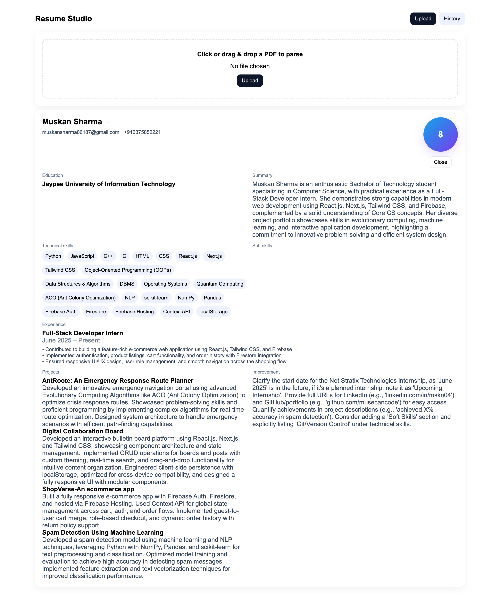
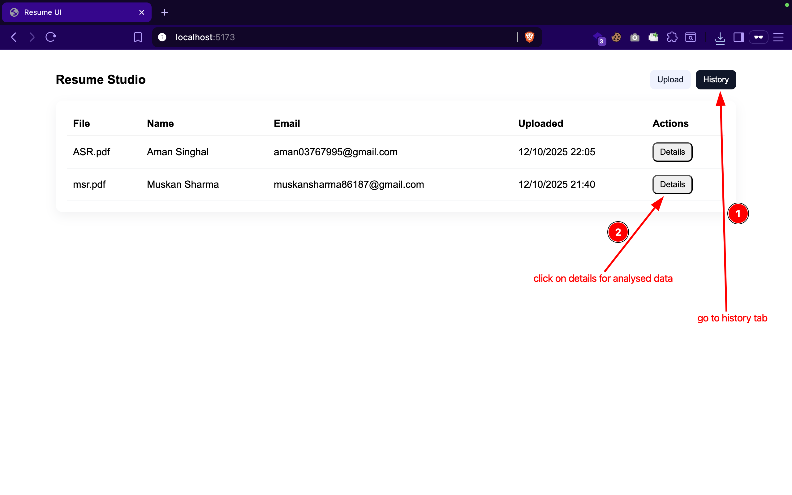
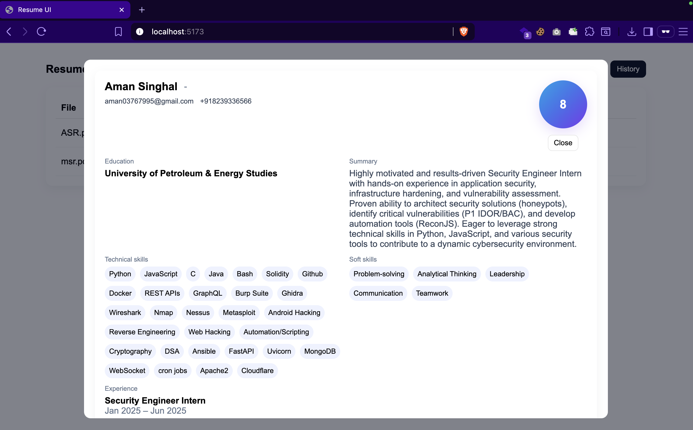

--- assignment @ deepklarity ---

A minimal resume parser and reviewer: upload a PDF resume, backend extracts structured fields using Gemini (Google GenAI), stores results in Postgres, and a small React UI displays the parsed data and history.

## What this project does
* Accepts PDF resumes via a simple upload UI.
* Extracts resume text and asks Gemini to return a strict JSON object with fields such as name, email, phone, links, summary, work_experience, education, technical_skills, soft_skills, projects, certifications, resume_rating, improvement_areas and upskill_suggestions.
* Saves parsed fields into Postgres.
* Shows a friendly frontend with:
  * Upload tab (drag & drop or click)
  * History tab (list of past uploads)
  * Details modal with the fully parsed resume

## Tech stack
* Backend: FastAPI, asyncpg, pdfplumber, google-generativeai SDK
* Frontend: React (Vite), single-file app at `frontend/src/App.jsx`
* DB: PostgreSQL (containerized)
* Run everything with Docker Compose

## Quick start (recommended)
1. Clone the repo:
   ```
   git clone <repo-url>
   cd <repo-directory>
   ```

2. Modify a `.env` file in the repo root with these values:

   ```
   GOOGLE_API_KEY=your_google_ai_studio_key_here
   ```

   * Add your Gemini/Generative AI API key from Google AI Studio as `GOOGLE_API_KEY`

3. Start with Docker Compose:
   ```
   docker compose up -d --build
   ```

   * Frontend: [http://localhost:5173]
   * Backend API docs: [http://localhost:8000/docs]
   * Postgres: port 5432 (containerized)

4. Open the UI in your browser at `http://localhost:5173`.
   * Drag & drop or click the upload area to send a PDF.
   * After parsing, a detailed card appears. Close it to see the entry in History.


## Files of interest
* `backend/main.py` — FastAPI app and LLM calling logic.
* `frontend/src/App.jsx` — single-file React UI (Upload, History, Details).
* `docker-compose.yml` — services and env mapping.
* `Dockerfile` (frontend / backend) — container build definitions.


## Example workflow
1. Add your Google AI Studio key to `.env` as `GOOGLE_API_KEY`.
2. `docker compose up -d --build`
3. Open `http://localhost:5173`, upload a PDF. Wait a few seconds for parsing.
4. Check `GET /resumes` or click History → Details to see the parsed card.

## Screenshots
Here’s a quick preview of the project in action:
| Upload Page | History Page | Resume Details |
|--------------|---------------|----------------|
|  |  |  |